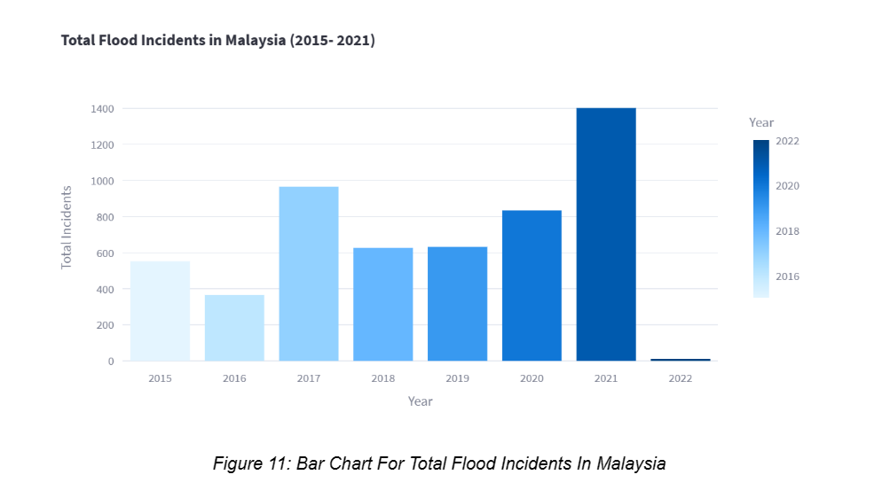
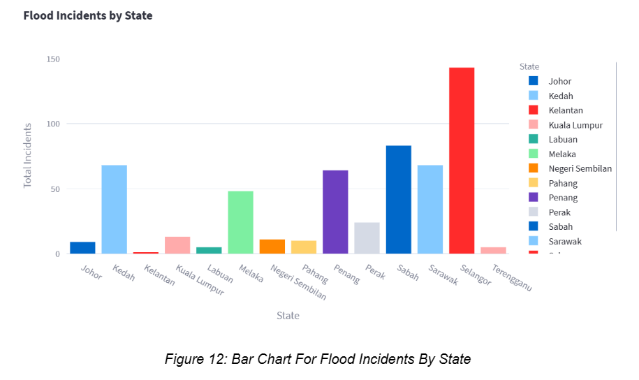
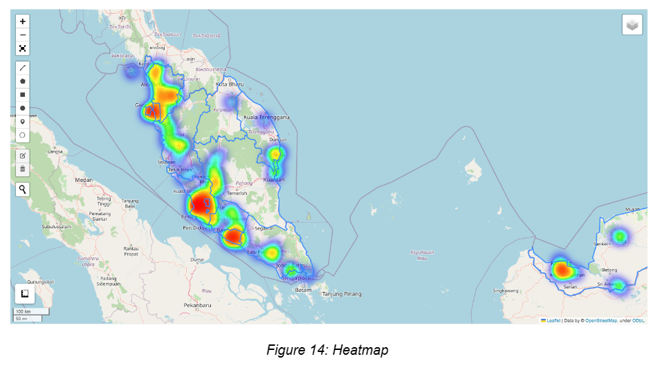
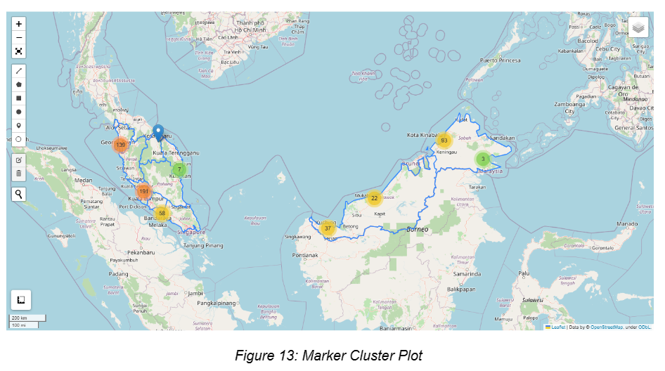

# Streamlit App For Flood

An app powered by Streamlit to visualize the flood incidents in Malaysia from 2015 to 2022. The flood incidents data is collected from the annual flood report published by the Department of Irrigation and Drainage. The report can be found here:

|Flood Annual Report|Link|
|-------------------|----|
|2015 Report|[Link](https://info.water.gov.my/index.php/databank/view_attachment/5486)|
|2016 Report|[Link](http://h2o.water.gov.my/man_hp1/Banjir_Tahun1617.pdf)|
|2017 Report|[link](http://h2o.water.gov.my/man_hp1/LBT2017-2018.pdf)|
|2018 Report|[Link](http://h2o.water.gov.my/man_hp1/LBT2018_2019.pdf)|
|2019 Report|[Link](http://h2o.water.gov.my/man_hp1/2019.pdf)|
|2020 Report|[Link](http://h2o.water.gov.my/man_hp1/LBT2020.pdf)|
|2021 Report|[Link](http://h2o.water.gov.my/man_hp1/LAPORAN%20BANJIR%20TAHUN%202021%20FINAL%20e-ISSN.pdf)|

## Objective
1. To visualize the flood incidents' statistics in Malaysia from 2015-2021.

## Features
1. Bar chart visualization
- Total flood incidents per year (2015 - 2021)

- Flood incidents per state

- Map visualization

Internship Project © 2023